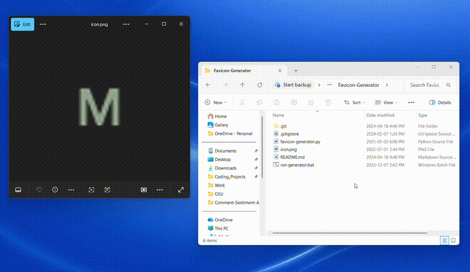

# Favicon Generator

A Python script that converts .png files into .ico format, enabling it's use as a favicon website icon.

## Table of Contents

- [Dependencies](#dependencies)
- [How To Install](#how-to-install)
- [How To Run the Converter](#how-to-run)
- [Credits](#credits)

## Dependencies

- Python 3.12
- Pillow Library 10.1.0

## How To Install

- Download the repository
- Create a virtual environment with the Pillow (Python Imaging Library) library
  - Open a new powershell terminal (Windows)
  - cd to the folder that you want the virtual environment in
  - run: python -m venv Favicon-Generator-Virtual-Env
- Update the run-generator.bat file to have the correct virtual environment path

## How To Run the Converter

- Save a .png file to the project folder
  - Note: make sure there are no other .png files in the folder
- Double-click the 'run-generator.bat' file
- The favicon will appear in the project folder (of file type .ico)
  - Note: This converter will not resize the image, so make sure the input file has the correct dimensions (recommended: 32px x 32px)

## Credits

Michelle Flandin
